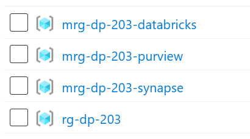
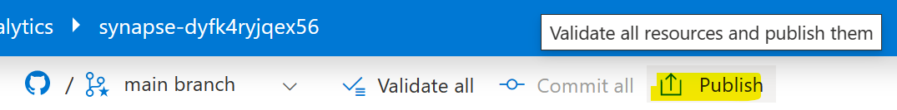

# DP-203 Setup for trainers (MCT)

Welcome to this repository, which aims to help MCT trainers to deploy a demo environment. It builds further on the work already done at the official [DP-203: Azure Data Engineer](https://github.com/MicrosoftLearning/dp-203-azure-data-engineer) git repository, which contains instructions and assets for hands-on excercises.

The [dp-203.bicep](./automation/dp-203.bicep) template can be used to deploy all the required resources:

- Data Lake with containers
- Synapse workspace
- Dedicated pool (will be paused every 2 hours)
- Spark pool (auto pause after 15 minutes of inactivity)
- Data explorer pool (will be paused every 2 hours)
- SQL Server with AdventureWorksLT database
- Eventhub + namespace
- Purview account
- Logic app to pause dedicated pool and data explorer pool every 2 hours
- Cosmos DB Account (no database yet)
- Databricks (without cluster)

To deploy this environment:

1. Open the [Azure Portal](https://portal.azure.com)
1. Open the Azure Cloud Shell using **BASH**
1. Execute the following command

    ```azurecli
    rm -r dp-203 -f
    git clone https://github.com/weslbo/dp-203.git
    cd dp-203
    userobjectid=$(az ad signed-in-user show --query id --output tsv)
    powerBIAdminEmailAddress=$(az ad signed-in-user show --query mail --output tsv)
    uniqueSuffix=weslbo
    read -p "Password for SQL Admin: " password
    ```

1. Execute the following commands to deploy the demo environment (this will take ~25 minutes). Any warning can be safely ignored. The data explorer pool takes the most time to deploy.

    ```azurecli
    az group create --name rg-dp-203 --location westeurope
    az deployment group create --name dp-203 --resource-group rg-dp-203 --template-file ./automation/dp-203.bicep --parameters sqlUser=azureuser sqlPassword=$password userobjectid=$userobjectid powerBIAdminEmailAddress=$powerBIAdminEmailAddress uniqueSuffix=$uniqueSuffix
    ```

    If you get any errors (#redtext), this happens usually when you re-deploy and the dedicated pool/data explorer pool is in a paused/stopped state

    | Resource | Duration | Remarks |
    |----------|----------|---------|
    | Data Lake | 30 sec | |
    | Synapse workspace | 10 min | |
    | Dedicated pool  | 5 min | if already deployed but in paused state -> error |
    | Spark pool | 15 sec | |
    | Data explorer pool  | 13 min | if already deployed but in stopped state -> error |
    | SQL Server | 8 min | |
    | Eventhub | 1.5 min | |
    | Purview account | 4 min | |
    | Logic app | 10 sec | |
    | Cosmos DB Account | 2 min | |
    | Databricks | 3 min | |

1. Verify it creates the resources + additional managed resource groups:

    

1. Open the Synapse workspace and click on **Publish**. The Synapse workspace has been associated automatically with this GitHub repository, but you will still need to publish the assets into the workspace itself.

    

1. Open the pipeline **00-setup-pipeline** and **execute** it (trigger now).
1. Validate files have been stored on the data lake container **files**/labs.

## Whiteboards

### DP-203-01-Intro to data engineering

[Introduction to data engineering on Azure](https://learn.microsoft.com/training/modules/introduction-to-data-engineering-azure/)


[Introduction to Azure Data Lake Storage Gen2](https://learn.microsoft.com/training/modules/introduction-to-azure-data-lake-storage/)


[Introduction to Azure Synapse Analytics](https://learn.microsoft.com/training/modules/introduction-azure-synapse-analytics/)


### DP-203-02-Serverless SQL

[Use Azure Synapse serverless SQL pool to query files in a data lake](https://learn.microsoft.com/training/modules/query-data-lake-using-azure-synapse-serverless-sql-pools/)


[Use Azure Synapse serverless SQL pools to transform data in a data lake](https://learn.microsoft.com/training/modules/use-azure-synapse-serverless-sql-pools-for-transforming-data-lake/)


[Create a lake database in Azure Synapse Analytics](https://learn.microsoft.com/training/modules/create-metadata-objects-azure-synapse-serverless-sql-pools/)


### DP-203-03-Spark

[Analyze data with Apache Spark in Azure Synapse Analytics](https://learn.microsoft.com/training/modules/understand-big-data-engineering-with-apache-spark-azure-synapse-analytics/)


[Transform data with Spark in Azure Synapse Analytics](https://learn.microsoft.com/training/modules/transform-data-spark-azure-synapse-analytics/)


[Use Delta Lake in Azure Synapse Analytics](https://learn.microsoft.com/training/modules/use-delta-lake-azure-synapse-analytics/)


### DP-203-04-Data Warehouse

[Analyze data in a relational data warehouse](https://learn.microsoft.com/training/modules/design-multidimensional-schema-to-optimize-analytical-workloads/)


[Load data into a relational data warehouse](https://learn.microsoft.com/training/modules/load-optimize-data-into-relational-data-warehouse/)


### DP-203-05-Pipelines

[Build a data pipeline in Azure Synapse Analytics](https://learn.microsoft.com/training/modules/build-data-pipeline-azure-synapse-analytics/)


[Use Spark Notebooks in an Azure Synapse Pipeline](https://learn.microsoft.com/training/modules/use-spark-notebooks-azure-synapse-pipeline/)


### DP-203-06-HTAP

[Plan hybrid transactional and analytical processing using Azure Synapse Analytics](https://learn.microsoft.com/training/modules/design-hybrid-transactional-analytical-processing-using-azure-synapse-analytics/)


[Implement Azure Synapse Link with Azure Cosmos DB](https://learn.microsoft.com/training/modules/configure-azure-synapse-link-with-azure-cosmos-db/)


[Implement Azure Synapse Link for SQL](https://learn.microsoft.com/training/modules/implement-synapse-link-for-sql/)


### DP-203-07-Stream Analytics

[Get started with Azure Stream Analytics](https://learn.microsoft.com/training/modules/introduction-to-data-streaming/)


[Ingest streaming data using Azure Stream Analytics and Azure Synapse Analytics](https://learn.microsoft.com/training/modules/ingest-streaming-data-use-azure-stream-analytics-synapse/)


[Visualize real-time data with Azure Stream Analytics and Power BI](https://learn.microsoft.com/training/modules/visualize-real-time-data-azure-stream-analytics-power-bi/)


### DP-203-08-Purview

[Introduction to Microsoft Purview](https://learn.microsoft.com/training/modules/intro-to-microsoft-purview/)


[Integrate Microsoft Purview and Azure Synapse Analytics](https://learn.microsoft.com/training/modules/integrate-microsoft-purview-azure-synapse-analytics/)


### DP-203-09-Databricks

[Explore Azure Databricks](https://learn.microsoft.com/training/modules/explore-azure-databricks/)


[Use Apache Spark in Azure Databricks](https://learn.microsoft.com/training/modules/use-apache-spark-azure-databricks/)


[Run Azure Databricks Notebooks with Azure Data Factory](https://learn.microsoft.com/training/modules/run-azure-databricks-notebooks-azure-data-factory/)


## Labs

see [labs](./labs_demos.md) for a list of labs and demos